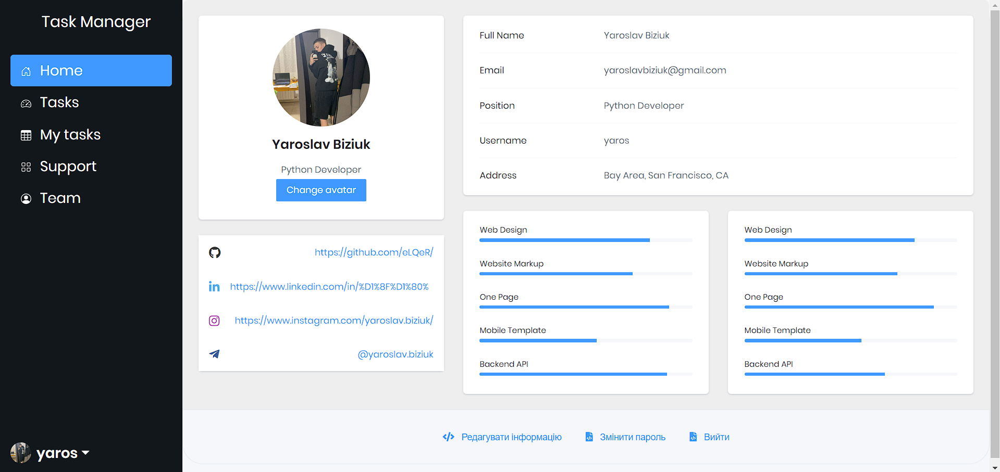

# IT Company Task Manager
Django project for managing tasks in IT Company

## Check it out!

[Task Manager project deployed to Render with PostgreSQL](https://it-company-task-manager-tvwp.onrender.com)

## Preparation

Create .env file like that: [.env_sample](.env_sample)

## Installation

Python3 must be already installed


```shell
git clone https://github.com/eLQeR/Company_Task_Manager.git
cd Company_Task_Manager
python3 -m venv venv
source venv/bin/activate
pip install -r requirements.txt
python manage.py runserver
```

## Demo




